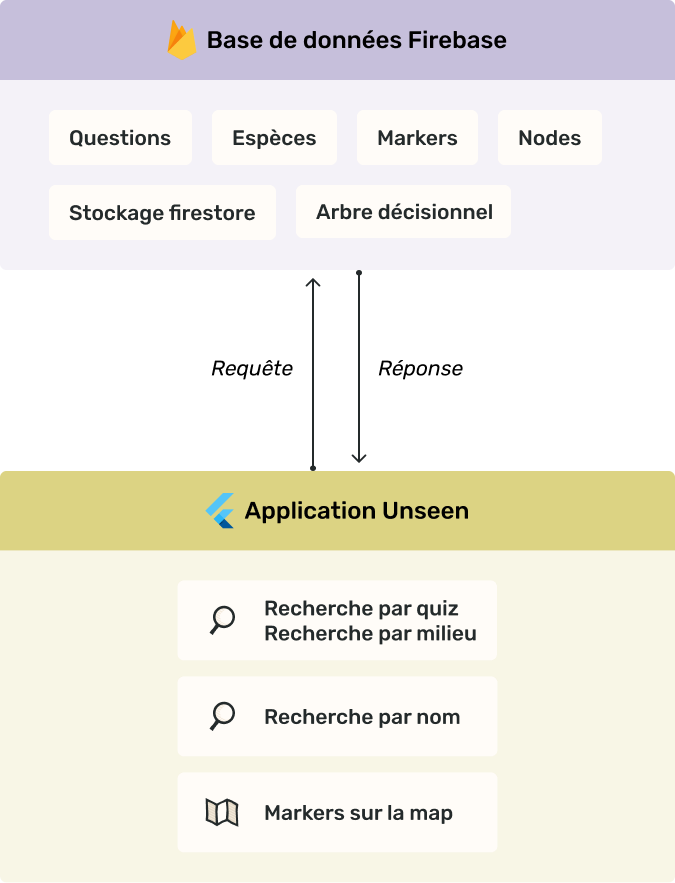

# Unseen - L'app qui te fera voir les petites bêtes d'un nouvel œil


Unseen est une application iOS et Android conçue pour les randonneurs et adeptes de la marche, se promenant en pleine nature. Elle permet d'avoir des informations sur les petites bêtes invisibles peuplant les parcs nationaux français. Ce projet a été réalisé dans le cadre d'un projet de fin d'année de troisième année de bachelor.

## Fonctionnalités

- Recherche de petites bêtes par ses caractéristiques physiques par un quiz (arbre de décisions)
- Recherche de petites bêtes par le milieu environnant (arbre de décision)
- Recherche de petites bêtes par nom de l'espèce
- Ajout de points sur la carte à l'endroit où nous sommes
- Informations d'une petite bête sur une fiche espèce

## Technologies utilisées


Flutter : framework fait par Google et utilisant le langage Dart, permettant de développer des applications iOS et Android sans faire deux applications séparées.
> Nous avons utilisé une architecture MVVM (Model-View-ViewModel) pour notre application.


Firebase : base de données NoSQL nous permettant de stocker les informations sur les espèces, l'arbre de décision des recherches, les points sur la carte ainsi que la plupart des images de l'application et celles uploadées par les utilisateurs pour les points sur la carte

|  |
|:-----------------------------------------------------------------------:|
|                           *Schéma technique*                            |

## Installation et lancement

1. Installez Unseen sur votre ordinateur. Assurez vous d'avoir le SDK Flutter installé.

```bash=
git clone https://github.com/MaxLepan/unseen_app.git
```

2. Installez les packages de l'application depuis le répertoire racine de l'application.

```bash=
cd unseen_app
flutter pub get
```

3. Lancez l'application.
> Pour iOS : assurez vous d'avoir installé Xcode.

Après avoir branché un appareil physique ou lancé un appareil virtuel, faites la commande `flutter run` ou appuyez sur le bouton "Run". Après un certain temps de build et d'installation, l'application est lancée.

---

Retrouvez notre site de présentation [ici](https://unseen-app.netlify.app/).

Projet réalisé par Marine, Romain, Max, Chloé A. et Chloé F.